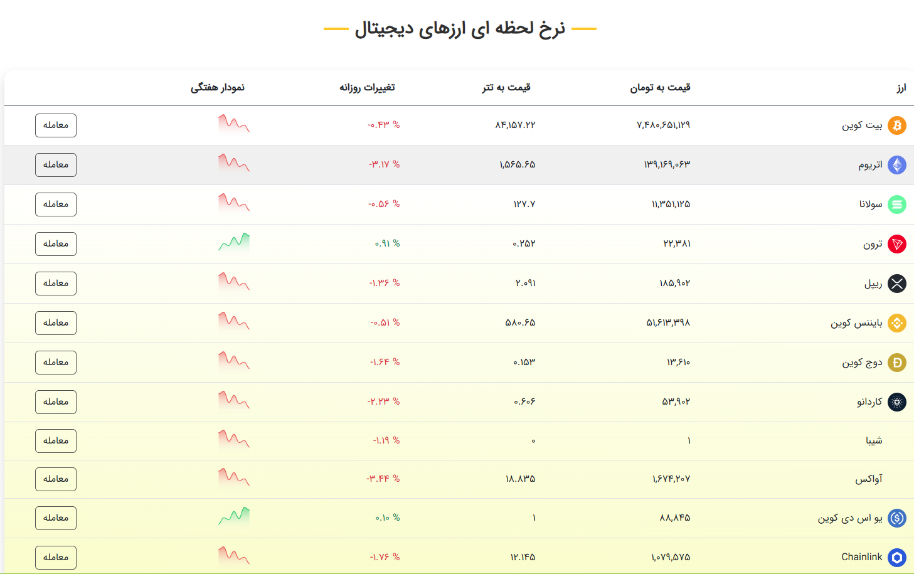

# ₿ bit-azar
- Bit Azar is a project I previously developed, offering all the features of a cryptocurrency exchange.

> **Note :** However, it wasn't fully based on optimal architectural patterns, although it functioned correctly. I’ve refactored parts of this extensive project to make it more readable.

## API Endpoint

### 🔹 **profit-and-loss**
| Method | Endpoint               | Description                           |
|--------|------------------------|---------------------------------------|
| **GET**   | `/reports/profit-loss`         | API for calculating the profit or loss status of a user's account. |

## Homepage
|| | |
|-----------|-----------|-----------|
|  |  |  |

